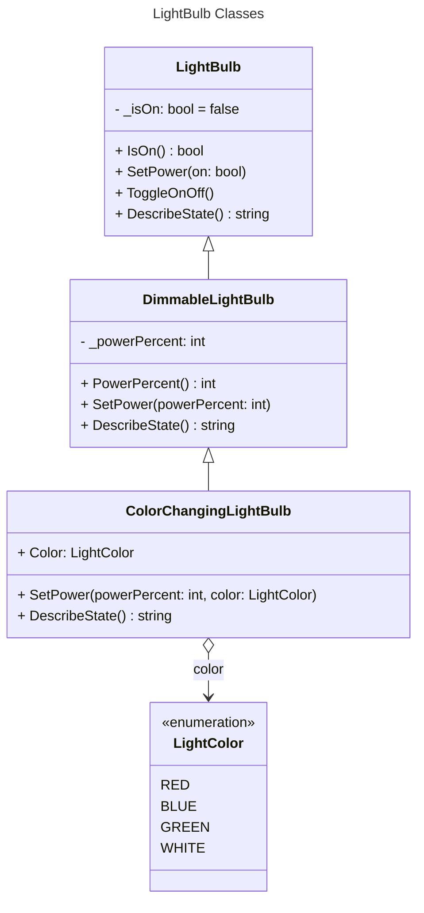

# Programming Theory Exercise

The project used for the Unity Junior Programmer, Apply Object-Oriented Principles exercise on programming theory.

The exercise is available here: https://learn.unity.com/pathway/junior-programmer/unit/apply-object-oriented-principles/tutorial/submission-programming-theory-in-action?version=6.0

This version of the code uses `6000.0.47f1`.

The implementation of LightBulb state is spread across three classes, as shown in the diagram below.

There is a "Light Bulb" prefab for the UI.  The "Light Bulb" UI has a "Type" property allowing a selection of 
* BASIC
* DIMMABLE
* COLOR_CHANGING

There is a single LightBulbController script supporting all three types of bulbs.

